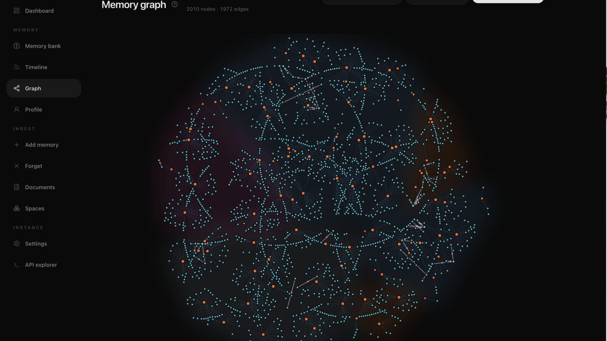
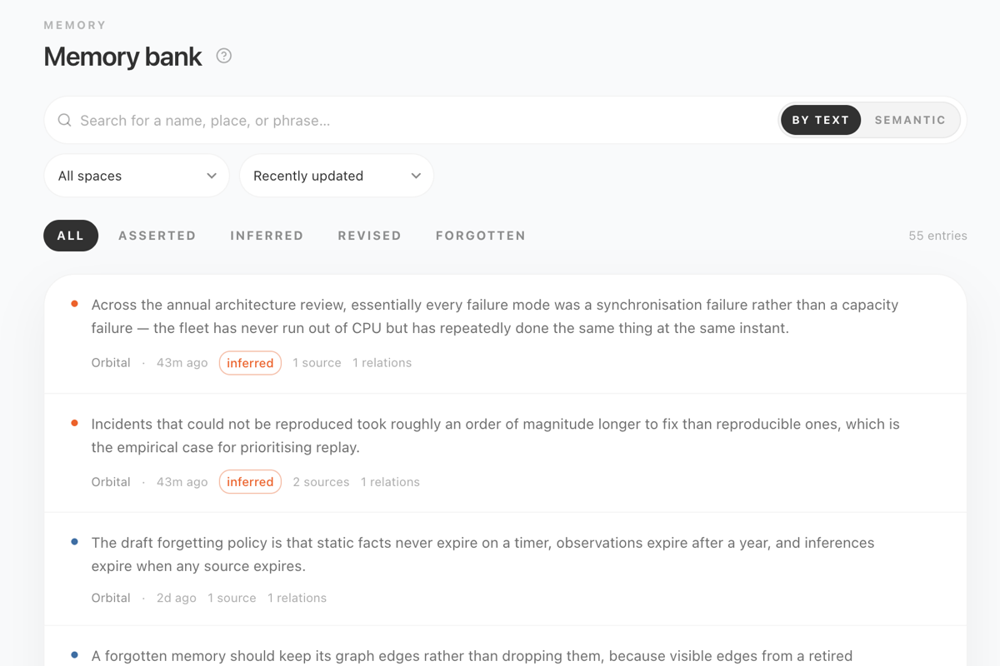
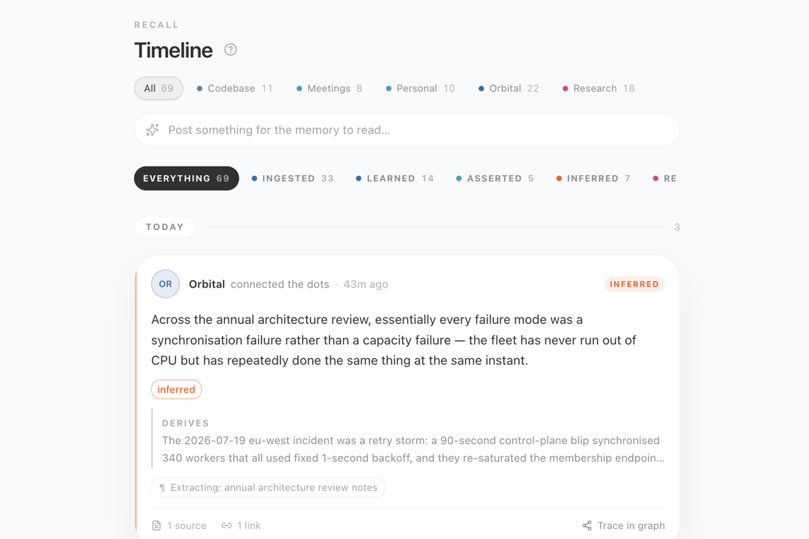

<p align="center">
  
</p>

<p align="center">
  <a href="https://github.com/wende/supermemory-ui/actions/workflows/ci.yml"></a>
  <a href="https://supermemory-ui.vercel.app"></a>
  <a href="LICENSE"></a>
  
  
</p>

<p align="center">
  <a href="https://supermemory-ui.vercel.app"><strong>Live demo</strong></a> ·
  <a href="#quick-start">Quick start</a> ·
  <a href="#connect-a-real-instance">Connect an instance</a> ·
  <a href="DESIGN.md">Design system</a> ·
  <a href="CONTRIBUTING.md">Contribute</a>
</p>

An open-source operator console for a [Supermemory](https://supermemory.ai)
memory engine. Browse extracted facts, follow ingestion, inspect revisions,
trace relationships, tune spaces, and query the API without losing sight of
how the system arrived at an answer.

It is useful before a server is running, too. The bundled mock backend has a
complete fabricated corpus and implements the same async ingest, versioning,
soft-forget, graph, and search semantics as the live surface.

> [!IMPORTANT]
> This is an unofficial, community-built project. It is not affiliated with,
> maintained by, or endorsed by Supermemory. All demo content and named
> personas are fabricated.

<p align="center">
  <a href="https://supermemory-ui.vercel.app">
    
  </a>
</p>

## One console for the whole memory lifecycle

- **Observe ingestion.** Documents visibly move through queued, extraction,
  chunking, embedding, indexing, and completion states.
- **Operate on facts.** Browse, search, revise, forget, restore, and inspect the
  version history of atomic memories.
- **Explain recall.** Follow `extends`, `derives`, and source relationships
  through a force-directed graph and focused neighbourhood views.
- **Read memory as a timeline.** See documents arrive and facts become learned,
  asserted, inferred, revised, or forgotten.
- **Scope the corpus.** Configure spaces, merge boundaries, filters, profile
  buckets, and extraction behaviour.
- **Explore the contract.** Exercise the documented Memory API from a built-in
  request console while credentials remain server-side.

<table>
  <tr>
    <td width="50%">
      
    </td>
    <td width="50%">
      
    </td>
  </tr>
  <tr>
    <td align="center"><strong>Memory bank</strong><br><sub>Search and operate on every extracted claim.</sub></td>
    <td align="center"><strong>Timeline</strong><br><sub>Watch knowledge arrive, change, connect, and retire.</sub></td>
  </tr>
</table>

## Quick start

Requires Node.js 20.9 or newer. This runs the same optimized Next.js build that
you would deploy:

```bash
git clone https://github.com/wende/supermemory-ui.git
cd supermemory-ui
npm ci
npm run build
npm run start
```

Open [http://localhost:3000](http://localhost:3000). No backend or API key is
needed: the console starts against its bundled mock and every screen is ready
to use.

Or try the hosted mock immediately at
[supermemory-ui.vercel.app](https://supermemory-ui.vercel.app).

[](https://vercel.com/new/clone?repository-url=https%3A%2F%2Fgithub.com%2Fwende%2Fsupermemory-ui&project-name=supermemory-ui&repository-name=supermemory-ui)

## Connect a real instance

Start the memory engine, then add its server-only connection details:

```bash
# terminal 1
supermemory-server

# .env.local
SUPERMEMORY_URL=http://localhost:6767
SUPERMEMORY_KEY=sm_your_key

# terminal 2
npm ci
npm run build
npm run start
```

The browser talks only to this app's `/api/*` routes. Next.js route handlers
proxy and adapt the Memory API, so the origin and API key never reach client
JavaScript and no CORS setup is required. See [`.env.example`](.env.example).

For richer runtime metadata when the console and engine share a machine, opt in
to reading the local install directory:

```bash
SUPERMEMORY_LOCAL_DIR=~/.supermemory
```

That adds the installed version, configured providers, storage path and size,
and process uptime to the runtime panel. Provider keys are used only to identify
which provider is configured; their values are never returned to the browser.

## How it fits together

```text
browser
  └─ /api/* route handlers
       ├─ mock contract  ── seeded, mutable, zero-config demo
       └─ remote adapter ── SUPERMEMORY_URL + SUPERMEMORY_KEY
```

Mock and remote are two backends behind one UI contract. Switching between
them does not replace the product model with a simplified demo model:

- `PATCH /v4/memories` creates version *n+1* and retains prior wording.
- Forgetting removes a memory from the active set but keeps its graph edges.
- New documents advance asynchronously through the ingest pipeline.
- Search is scored and ranked; mode, threshold, limit, reranking, aggregation,
  rewrite, and include options all affect results.
- State persists for the server process and resets on restart or a cold
  serverless instance. The mock is intentionally not a database.

## Surfaces

| Surface | Operator job | Primary API |
|---|---|---|
| **Overview** | Corpus health, ingest activity, latency, runtime | `/stats`, `/health`, `/v3/documents/processing` |
| **Memory bank** | Search, revise, forget, restore, inspect history | `/v4/memories/*`, `/v4/search` |
| **Timeline** | Follow documents and memory lifecycle events | `/v3/documents/*`, `/v4/memories/*` |
| **Graph** | Trace memories, documents, spaces, and typed edges | `/v4/graph` |
| **Add memory** | Write, link, upload, batch, or assert | `/v3/documents/*`, `/v4/memories` |
| **Documents** | Inspect pipeline state, chunks, and metadata | `/v3/documents/*` |
| **Spaces** | Scope, filter, merge, and configure corpora | `/v3/container-tags/*` |
| **Profile** | Inspect synthesized facts and custom buckets | `/v4/profile/*` |
| **Settings** | Tune extraction, workspace, and runtime behaviour | `/v3/settings/*` |
| **API explorer** | Send requests across the documented surface | all documented endpoints |

## Interface architecture

Visited tabs stay mounted inside `RouteHost`, so scroll position, graph state,
forms, and DOM state survive navigation. A small stale-while-revalidate cache
deduplicates identical requests, warms routes while the browser is idle, and
invalidates every derived view after corpus mutations.

Pages live in `src/routes/`, URL stubs in `src/app/`, and the route registry in
`src/routes/registry.ts`. The event model behind Timeline is a pure function in
`src/lib/timeline.ts`; the mock Memory API lives under `src/app/api/`.

The visual system is documented in Storybook and in [`DESIGN.md`](DESIGN.md):
quiet light/dark surfaces, dense operator-first layouts, and a
colour-vision-validated categorical palette where colour is never the only
signal.

## Development

Use the development server only when working on the project:

```bash
npm install
npm run dev             # local development with hot reload
npm run typecheck       # strict TypeScript check
npm test                # Vitest suite
npm run storybook       # component workbench on :6006
npm run build-storybook # static Storybook build
```

GitHub Actions and Vercel deploy independently; the exact checks and deployment
triggers are documented in [`.github/workflows/README.md`](.github/workflows/README.md).

## Stack

Next.js 16 App Router · React 19 · strict TypeScript · Tailwind CSS v4 · Radix
primitives · d3-force · Vitest · Storybook.

## Project

- Read [`CONTRIBUTING.md`](CONTRIBUTING.md) before opening a pull request.
- Use [GitHub Issues](https://github.com/wende/supermemory-ui/issues) for bugs
  and feature proposals.
- Report vulnerabilities privately as described in
  [`SECURITY.md`](SECURITY.md).
- Review the community expectations in
  [`CODE_OF_CONDUCT.md`](CODE_OF_CONDUCT.md).

## License

[MIT](LICENSE) © Krzysztof Wende.
